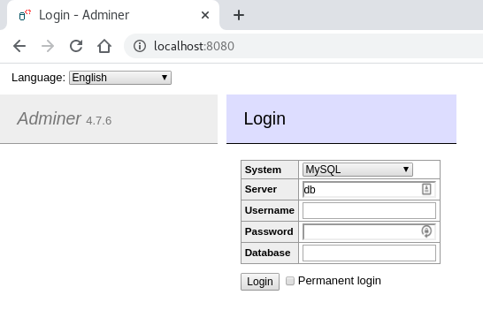
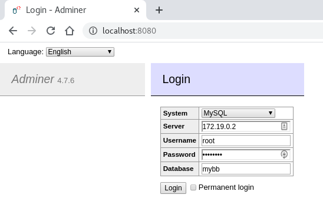
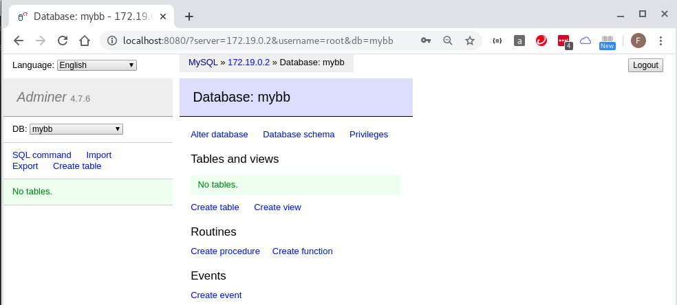
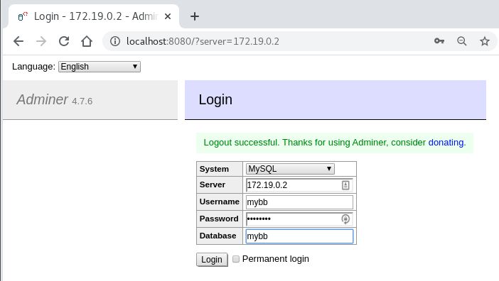
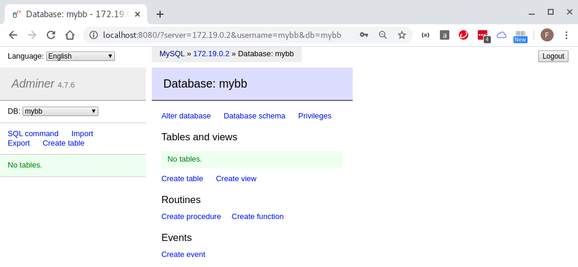
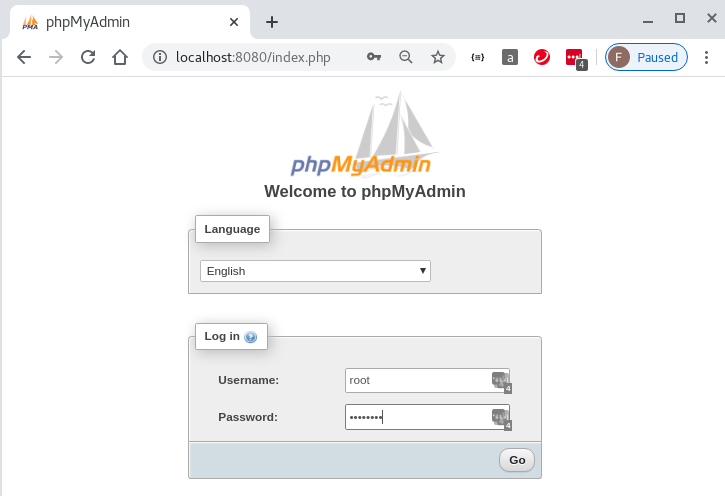
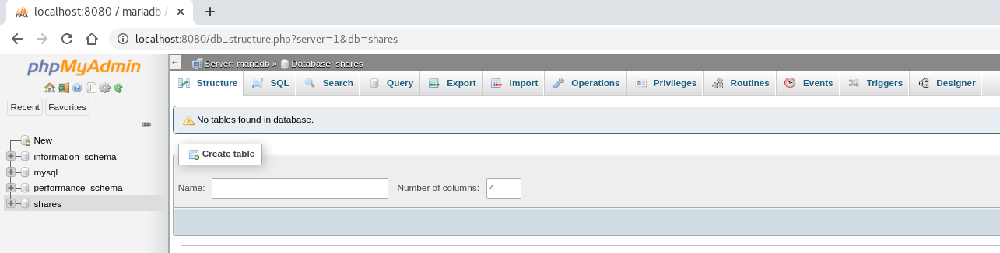
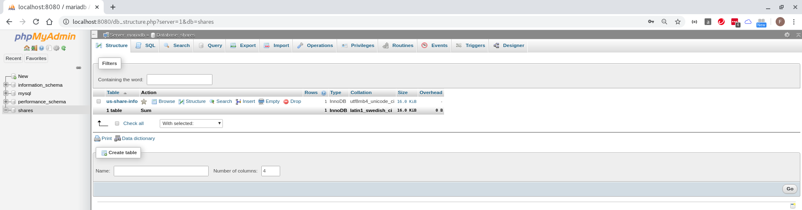
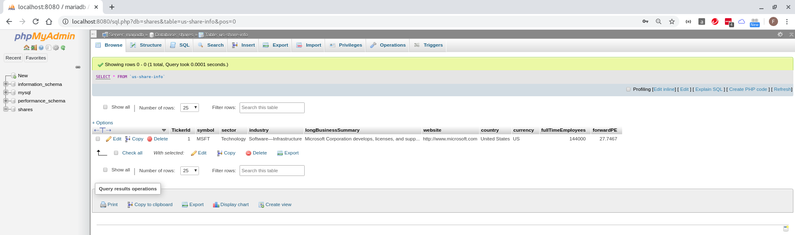

## test yahoo finance API in container

```
docker run -it python:3.8 bash

pip install yfinance lxml

root@e6303538de1d:/# pip list
Package         Version   
--------------- ----------
certifi         2020.4.5.1
chardet         3.0.4     
idna            2.9       
multitasking    0.0.9     
numpy           1.18.3    
pandas          1.0.3     
pip             20.0.2    
python-dateutil 2.8.1     
pytz            2020.1    
requests        2.23.0    
setuptools      46.1.3    
six             1.14.0    
urllib3         1.25.9    
wheel           0.34.2    
yfinance        0.1.54    
root@e6303538de1d:/# 

apt -y install
apt -y install vim

root@e6303538de1d:/# vim yahoo.py
root@e6303538de1d:/# cat yahoo.py
import yfinance as yf

msft = yf.Ticker("MSFT")

# get stock info
print(msft.info)

# get historical market data
hist = msft.history(period="5d")

root@e6303538de1d:/# 

root@e6303538de1d:/# python yahoo.py 
{'zip': '98052', 'sector': 'Technology', 'fullTimeEmployees': 144000, 'longBusinessSummary': 'Microsoft Corporation develops, licenses, and supports software, services, devices, and solutions worldwide. Its Productivity and Business Processes segment offers Office, Exchange, SharePoint, Microsoft Teams, Office 365 Security and Compliance, and Skype for Business, as well as related Client Access Licenses (CAL); and Skype, Outlook.com, and OneDrive. It also provides LinkedIn that includes Talent and marketing solutions, and subscriptions; and Dynamics 365, a set of cloud-based and on-premises business solutions for small and medium businesses, large organizations, and divisions of enterprises. Its Intelligent Cloud segment licenses SQL and Windows Servers, Visual Studio, System Center, and related CALs; GitHub that provides a collaboration platform and code hosting service for developers; and Azure, a cloud platform. It also provides support services and Microsoft consulting services to assist customers in developing, deploying, and managing Microsoft server and desktop solutions; and training and certification to developers and IT professionals on various Microsoft products. Its More Personal Computing segment offers Windows OEM licensing and other non-volume licensing of the Windows operating system; Windows Commercial, such as volume licensing of the Windows operating system, Windows cloud services, and other Windows commercial offerings; patent licensing; Windows Internet of Things; and MSN advertising. It also provides Microsoft Surface, PC accessories, and other intelligent devices; Gaming, including Xbox hardware, and Xbox software and services; video games and third-party video game royalties; and Search, including Bing and Microsoft advertising. It sells its products through distributors and resellers; and directly through digital marketplaces, online stores, and retail stores. It has strategic partnerships with Humana Inc., Nokia, Telkomsel, Swiss Re, and Kubota Corporation. The company was founded in 1975 and is headquartered in Redmond, Washington.', 'city': 'Redmond', 'phone': '425-882-8080', 'state': 'WA', 'country': 'United States', 'companyOfficers': [], 'website': 'http://www.microsoft.com', 'maxAge': 1, 'address1': 'One Microsoft Way', 'fax': '425-706-7329', 'industry': 'Software—Infrastructure', 'previousClose': 174.05, 'regularMarketOpen': 175.59, 'twoHundredDayAverage': 158.27147, 'trailingAnnualDividendYield': 0.011146222, 'payoutRatio': 0.32930002, 'volume24Hr': None, 'regularMarketDayHigh': 175.6672, 'navPrice': None, 'averageDailyVolume10Day': 37969233, 'totalAssets': None, 'regularMarketPreviousClose': 174.05, 'fiftyDayAverage': 158.39658, 'trailingAnnualDividendRate': 1.94, 'open': 175.59, 'toCurrency': None, 'averageVolume10days': 37969233, 'expireDate': None, 'yield': None, 'algorithm': None, 'dividendRate': 2.04, 'exDividendDate': 1589932800, 'beta': 0.962017, 'circulatingSupply': None, 'startDate': None, 'regularMarketDayLow': 169.39, 'priceHint': 2, 'currency': 'USD', 'trailingPE': 29.57847, 'regularMarketVolume': 34392694, 'lastMarket': None, 'maxSupply': None, 'openInterest': None, 'marketCap': 1291583356928, 'volumeAllCurrencies': None, 'strikePrice': None, 'averageVolume': 55443984, 'priceToSalesTrailing12Months': 9.620805, 'dayLow': 169.39, 'ask': 172.38, 'ytdReturn': None, 'askSize': 1200, 'volume': 34392694, 'fiftyTwoWeekHigh': 190.7, 'forwardPE': 27.746733, 'fromCurrency': None, 'fiveYearAvgDividendYield': 1.97, 'fiftyTwoWeekLow': 119.01, 'bid': 172.1, 'tradeable': False, 'dividendYield': 0.0117, 'bidSize': 1100, 'dayHigh': 175.6672, 'exchange': 'NMS', 'shortName': 'Microsoft Corporation', 'longName': 'Microsoft Corporation', 'exchangeTimezoneName': 'America/New_York', 'exchangeTimezoneShortName': 'EDT', 'isEsgPopulated': False, 'gmtOffSetMilliseconds': '-14400000', 'quoteType': 'EQUITY', 'symbol': 'MSFT', 'messageBoardId': 'finmb_21835', 'market': 'us_market', 'annualHoldingsTurnover': None, 'enterpriseToRevenue': 9.51, 'beta3Year': None, 'profitMargins': 0.33016, 'enterpriseToEbitda': 20.84, '52WeekChange': 0.33269525, 'morningStarRiskRating': None, 'forwardEps': 6.12, 'revenueQuarterlyGrowth': None, 'sharesOutstanding': 7606049792, 'fundInceptionDate': None, 'annualReportExpenseRatio': None, 'bookValue': 14.467, 'sharesShort': 53310482, 'sharesPercentSharesOut': 0.0069999998, 'fundFamily': None, 'lastFiscalYearEnd': 1561852800, 'heldPercentInstitutions': 0.74088997, 'netIncomeToCommon': 44323000320, 'trailingEps': 5.741, 'lastDividendValue': None, 'SandP52WeekChange': -0.022862852, 'priceToBook': 11.737748, 'heldPercentInsiders': 0.01421, 'nextFiscalYearEnd': 1625011200, 'mostRecentQuarter': 1577750400, 'shortRatio': 0.82, 'sharesShortPreviousMonthDate': 1584057600, 'floatShares': 7494998724, 'enterpriseValue': 1276748496896, 'threeYearAverageReturn': None, 'lastSplitDate': 1045526400, 'lastSplitFactor': '2:1', 'legalType': None, 'morningStarOverallRating': None, 'earningsQuarterlyGrowth': 0.383, 'dateShortInterest': 1586908800, 'pegRatio': 2.16, 'lastCapGain': None, 'shortPercentOfFloat': 0.0069999998, 'sharesShortPriorMonth': 55155176, 'category': None, 'fiveYearAverageReturn': None, 'regularMarketPrice': 175.59, 'logo_url': 'https://logo.clearbit.com/microsoft.com'}
root@e6303538de1d:/# 
```

## build up mariadb container

* create `docker-compose.yml`
```
[fli@192-168-1-4 share-get-data]$ cat docker-compose.yml 
version: '3'

volumes: 
  mariadb_data:
    driver: local

networks:
  backend:
    driver: bridge

services:
  mariadb:
    image: mariadb:latest
    container_name: mariadb
    restart: always
    environment:
      MYSQL_ROOT_PASSWORD: changeme
      MYSQL_DATABASE: mybb
      MYSQL_USER: mybb
      MYSQL_PASSWORD: changeme
    networks:
      - backend
    ports:
      - '3306:3306'
    volumes:
      - mariadb_data:/var/lib/mysql
[fli@192-168-1-4 share-get-data]$ 
```

* spin up mariadb container and check its volume and network

```
docker-compose up -d

[fli@192-168-1-4 share-get-data]$ docker container ls --all
CONTAINER ID        IMAGE               COMMAND                  CREATED             STATUS              PORTS                    NAMES
98bb65e6792e        mariadb:latest      "docker-entrypoint.s…"   2 hours ago         Up 2 hours          0.0.0.0:3306->3306/tcp   share-get-data_mariadb_1
[fli@192-168-1-4 share-get-data]$ 

[fli@192-168-1-4 share-get-data]$ docker container inspect 98b --format='{{range .NetworkSettings.Networks}}{{.IPAddress}}{{end}}'
172.18.0.2
[fli@192-168-1-4 share-get-data]$ 

[fli@192-168-1-4 share-get-data]$ docker volume ls
DRIVER              VOLUME NAME
local               share-get-data_mariadb_data
[fli@192-168-1-4 share-get-data]$

[fli@192-168-1-4 share-get-data]$ docker network ls
NETWORK ID          NAME                     DRIVER              SCOPE
c99303b1d5b2        bridge                   bridge              local
3998d62e2b3f        host                     host                local
7747599528aa        none                     null                local
33cbae2bb7a9        share-get-data_backend   bridge              local
[fli@192-168-1-4 share-get-data]$ 
```

* login new mariadb container database

> Note: `mysql -h localhost -u root -p` wont work. MySQL connects over TCP/IP when using IP address (127.0.0.1), and uses socket file when using localhost. In this situation, the `mysql.sock` is not available at `/var/lib/mysql/` by default. 

```
[fli@192-168-1-4 ~]$ mysql -h localhost -u root -p
Enter password: 
ERROR 2002 (HY000): Can't connect to local MySQL server through socket '/var/lib/mysql/mysql.sock' (2)
[fli@192-168-1-4 ~]$

[fli@192-168-1-4 ~]$ which mysql
/usr/bin/mysql
[fli@192-168-1-4 ~]$ mysql -h 127.0.0.1 -u root -p
Enter password: 
Welcome to the MariaDB monitor.  Commands end with ; or \g.
Your MariaDB connection id is 8
Server version: 10.4.12-MariaDB-1:10.4.12+maria~bionic mariadb.org binary distribution

Copyright (c) 2000, 2018, Oracle, MariaDB Corporation Ab and others.

Type 'help;' or '\h' for help. Type '\c' to clear the current input statement.

MariaDB [(none)]> show databases;
+--------------------+
| Database           |
+--------------------+
| information_schema |
| mybb               |
| mysql              |
| performance_schema |
+--------------------+
4 rows in set (0.00 sec)

MariaDB [(none)]> select host,user from mysql.user;
+-----------+------+
| Host      | User |
+-----------+------+
| %         | mybb |
| %         | root |
| localhost | root |
+-----------+------+
3 rows in set (0.00 sec)

MariaDB [(none)]> show grants for 'mybb'@'%';
+-----------------------------------------------------------------------------------------------------+
| Grants for mybb@%                                                                                   |
+-----------------------------------------------------------------------------------------------------+
| GRANT USAGE ON *.* TO 'mybb'@'%' IDENTIFIED BY PASSWORD '*7ACE763ED393514FE0C162B93996ECD195FFC4F5' |
| GRANT ALL PRIVILEGES ON `mybb`.* TO 'mybb'@'%'                                                      |
+-----------------------------------------------------------------------------------------------------+
2 rows in set (0.00 sec)

MariaDB [(none)]> exit
Bye
[fli@192-168-1-4 ~]$ 
```

## add mariadb adminer container

* update `docker-compose.yml`

```
[fli@192-168-1-4 share-get-data]$ cat docker-compose.yml 
version: '3'

volumes: 
  mariadb_data:
    driver: local

networks:
  backend:
    driver: bridge

services:
  mariadb:
    image: mariadb:latest
    container_name: mariadb
    restart: always
    environment:
      MYSQL_ROOT_PASSWORD: changeme
      MYSQL_DATABASE: mybb
      MYSQL_USER: mybb
      MYSQL_PASSWORD: changeme
    networks:
      - backend
    ports:
      - '3306:3306'
    volumes:
      - mariadb_data:/var/lib/mysql
  
  adminer:
    image: adminer
    container_name: adminer
    restart: always
    networks:
      - backend
    ports:
      - 8080:8080
[fli@192-168-1-4 share-get-data]$ 
```

* spin up containers

```
docker-compose up -d

[fli@192-168-1-4 share-get-data]$ docker container ls
CONTAINER ID        IMAGE               COMMAND                  CREATED             STATUS              PORTS                    NAMES
4612b503eafd        adminer             "entrypoint.sh docke…"   15 minutes ago      Up 15 minutes       0.0.0.0:8080->8080/tcp   adminer
3fe495805afe        mariadb:latest      "docker-entrypoint.s…"   15 minutes ago      Up 15 minutes       0.0.0.0:3306->3306/tcp   mariadb
[fli@192-168-1-4 share-get-data]$ docker container inspect 3fe --format='{{range .NetworkSettings.Networks}}{{.IPAddress}}{{end}}'
172.19.0.2
[fli@192-168-1-4 share-get-data]$  
```

* access `adminer` from browser by user `root`







* access `adminer` from browser by user `mybb`





## change `mariadb adminer` container to `phpmyadmin` container

* the default `phpmyadmin` configuration settings

```
[fli@192-168-1-4 share-get-data]$ docker container ls
CONTAINER ID        IMAGE                          COMMAND                  CREATED             STATUS              PORTS                    NAMES
33b15ce109f0        phpmyadmin/phpmyadmin:latest   "/docker-entrypoint.…"   10 minutes ago      Up 10 minutes       0.0.0.0:8080->80/tcp     phpmyadmin
48400b0dd689        share-get-data_get             "sh -c 'sleep infini…"   10 minutes ago      Up 10 minutes                                getdata
2efd730efca8        mariadb:latest                 "docker-entrypoint.s…"   10 minutes ago      Up 10 minutes       0.0.0.0:3306->3306/tcp   mariadb
[fli@192-168-1-4 share-get-data]$ docker exec -it 33b bash
root@33b15ce109f0:/var/www/html# cd /etc/phpmyadmin/
root@33b15ce109f0:/etc/phpmyadmin# ls -l
total 12
-rw-r--r--. 1 root root 4642 Apr 18 16:15 config.inc.php
-rw-r--r--. 1 root root   68 Apr 30 12:33 config.secret.inc.php
-rw-r--r--. 1 root root    0 Apr 30 12:33 config.user.inc.php
root@33b15ce109f0:/etc/phpmyadmin#

root@33b15ce109f0:/etc/phpmyadmin# cat config.secret.inc.php 
<?php
$cfg['blowfish_secret'] = '%#9Q/>RVYqzTWw7VN_d9p8Jg).l{pDh_';
root@33b15ce109f0:/etc/phpmyadmin# 

root@33b15ce109f0:/etc/phpmyadmin# cat config.user.inc.php 
root@33b15ce109f0:/etc/phpmyadmin# 
```

> Note: [Adding Custom Configuration to phpmyadmin](https://hub.docker.com/r/phpmyadmin/phpmyadmin/)

You can add your own custom `config.inc.php` settings (such as Configuration Storage setup) by creating a file named `config.user.inc.php` with the various user defined settings in it, and then linking it into the container using:

`-v /some/local/directory/config.user.inc.php:/etc/phpmyadmin/config.user.inc.php`

On the `docker run` line like this:

`docker run --name myadmin -d --link mysql_db_server:db -p 8080:80 -v /some/local/directory/config.user.inc.php:/etc/phpmyadmin/config.user.inc.php phpmyadmin/phpmyadmin`

* create `config.user.inc.php` to enable row actions
```
[fli@192-168-1-4 share-get-data]$ cat phpmyadmin/config.user.inc.php 
<?php
$cfg['ActionLinksMode'] = 'both';
[fli@192-168-1-4 share-get-data]$ 
```

* update `docker-compose.yml` to mount `phpmyadmin` to `/etc/phpmyadmin`

```
[fli@192-168-1-4 share-get-data]$ cat docker-compose.yml 
version: '3'

volumes: 
  mariadb_data:
    driver: local

networks:
  backend:
    driver: bridge

services:

  get:
    build: ./app
    container_name: getdata
    environment:
      DB_HOST: mariadb
      DB_NAME: shares
      DB_USER: fen9li
      DB_PASS: changeme
    volumes:
      - ${PWD}/app:/app
    networks:
      - backend
    depends_on:
      - mariadb

  phpmyadmin:
    image: phpmyadmin/phpmyadmin:latest
    container_name: phpmyadmin
    networks:
      - backend
    ports:
      - '8080:80'
    volumes:
      - /sessions
      - ${PWD}/phpmyadmin/config.user.inc.php:/etc/phpmyadmin/config.user.inc.php
    environment:
      - PMA_HOST=mariadb
    depends_on:
      - mariadb

  mariadb:
    image: mariadb:latest
    container_name: mariadb
    restart: always
    environment:
      MYSQL_ROOT_PASSWORD: changeme
      MYSQL_DATABASE: shares
      MYSQL_USER: fen9li
      MYSQL_PASSWORD: changeme
    networks:
      - backend
    ports:
      - '3306:3306'
    volumes:
      - mariadb_data:/var/lib/mysql
[fli@192-168-1-4 share-get-data]$      
```

> Note 1: map ports for `phpmyadmin - 8080:80` - this maps inner port `80` from inside the container, to port `8000` on docker host machine.    
> Note 2: environment variable `PMA_ARBITRARY=1` can be set to add 'server' input field to phpmyadmin login page.

* spin up containers

```
docker-compose up -d


[fli@192-168-1-4 share-get-data]$ docker container ls
CONTAINER ID        IMAGE                          COMMAND                  CREATED             STATUS              PORTS                    NAMES
6df7518cf67b        phpmyadmin/phpmyadmin:latest   "/docker-entrypoint.…"   29 seconds ago      Up 25 seconds       0.0.0.0:8080->80/tcp     phpmyadmin
3ad47e8647ec        share-get-data_get             "sh -c 'sleep infini…"   29 seconds ago      Up 26 seconds                                getdata
547f64199b2d        mariadb:latest                 "docker-entrypoint.s…"   30 seconds ago      Up 28 seconds       0.0.0.0:3306->3306/tcp   mariadb
[fli@192-168-1-4 share-get-data]$ docker volume ls
DRIVER              VOLUME NAME
local               0a326b229de917464f10fe71681c8b28594870840880fb47a2b1708d2fb87298
local               share-get-data_mariadb_data
[fli@192-168-1-4 share-get-data]$ docker network ls
NETWORK ID          NAME                     DRIVER              SCOPE
2ab7425f6078        bridge                   bridge              local
3998d62e2b3f        host                     host                local
7747599528aa        none                     null                local
2c8a8fa93640        share-get-data_backend   bridge              local
[fli@192-168-1-4 share-get-data]$ 

[fli@192-168-1-4 share-get-data]$ docker container inspect 547 --format='{{range .NetworkSettings.Networks}}{{.IPAddress}}{{end}}'
192.168.144.2
[fli@192-168-1-4 share-get-data]$     
```

* access `phpmyadmin` container from browser by user `root`





## create `us-share-info` table in mariadb

* create/update `mariadb/shares.sql`

* import `mariadb/shares.sql` to mariadb

```
[fli@192-168-1-4 share-get-data]$ pwd
/home/fli/share-get-data
[fli@192-168-1-4 share-get-data]$ ls mariadb/
shares.sql
[fli@192-168-1-4 share-get-data]$ docker exec -i mariadb mysql -uroot -pchangeme shares < mariadb/shares.sql
[fli@192-168-1-4 share-get-data]$ 
```





## create/update `app/get.py`
```
[fli@192-168-1-4 share-get-data]$ cat app/get.py 
import yfinance as yf
import os, json, time 
import pymysql.cursors

config = {
  'host': os.environ['DB_HOST'],
  'db': os.environ['DB_NAME'],
  'user': os.environ['DB_USER'],
  'password': os.environ['DB_PASS'],
  'charset': 'utf8mb4',
  'cursorclass': pymysql.cursors.DictCursor
}

connection = pymysql.connect(**config)

try:
  with connection.cursor() as cursor:
    # Create a new record
    sql = "INSERT INTO `us-share-info` (`symbol`, `sector`, `industry`, `longBusinessSummary`, `website`, `country`, `currency`, `fullTimeEmployees`, `forwardPE`) VALUES (%s, %s, %s, %s, %s, %s, %s, %s, %s)"
    cursor.execute(sql, ('MSFT', 'Technology', 'Software—Infrastructure', 'Microsoft Corporation develops, licenses, and supports software, services, devices, and solutions worldwide. Its Productivity and Business Processes segment offers Office, Exchange, SharePoint, Microsoft Teams, Office 365 Security and Compliance, and Skype for Business, as well as related Client Access Licenses (CAL); and Skype, Outlook.com, and OneDrive.', 'http://www.microsoft.com', 'United States', 'US', 144000, 27.746733 ))
 
    # connection is not autocommit by default. So you must commit to save
    # your changes.
  connection.commit()
 
  with connection.cursor() as cursor:
    # Read a single record
    sql = "SELECT `symbol`, `sector` FROM `us-share-info` WHERE `symbol`=%s"
    cursor.execute(sql, ('MSFT',))
    result = cursor.fetchone()
    print(result)
finally:
  connection.close()

msft = yf.Ticker("MSFT")
stockinfo = msft.info

while True:
  time.sleep(1)
[fli@192-168-1-4 share-get-data]$ 
```


## Appendix: Test connecting to mariadb container from inside `getdata` container

```
[fli@192-168-1-4 share-get-data]$ cat Dockerfile
FROM python:3.8.2-slim

COPY requirements.txt /
RUN pip install -r /requirements.txt

VOLUME /app
WORKDIR /app

CMD ["sh", "-c", "sleep infinity"]
[fli@192-168-1-4 share-get-data]$ 

[fli@192-168-1-4 share-get-data]$ docker images
REPOSITORY              TAG                 IMAGE ID            CREATED             SIZE
mariadb                 latest              b6184b68d1fd        5 days ago          357MB
python                  3.8.2-slim          e8ad3533cb52        6 days ago          194MB
phpmyadmin/phpmyadmin   latest              f257b784d16f        11 days ago         468MB
[fli@192-168-1-4 share-get-data]$ 

docker-compose up -d

[fli@192-168-1-4 ~]$ docker container ls
CONTAINER ID        IMAGE                          COMMAND                  CREATED             STATUS              PORTS                    NAMES
6df7518cf67b        phpmyadmin/phpmyadmin:latest   "/docker-entrypoint.…"   12 minutes ago      Up 12 minutes       0.0.0.0:8080->80/tcp     phpmyadmin
3ad47e8647ec        share-get-data_get             "sh -c 'sleep infini…"   12 minutes ago      Up 12 minutes                                getdata
547f64199b2d        mariadb:latest                 "docker-entrypoint.s…"   12 minutes ago      Up 12 minutes       0.0.0.0:3306->3306/tcp   mariadb
[fli@192-168-1-4 ~]$ 

[fli@192-168-1-4 ~]$ docker container exec -it 3ad bash
root@3ad47e8647ec:/app# ls -l
total 12
-rw-rw-r--. 1 1000 1000  148 Apr 30 13:45 Dockerfile
-rw-rw-r--. 1 1000 1000 1564 Apr 30 13:44 get.py
-rw-rw-r--. 1 1000 1000   45 Apr 30 07:32 requirements.txt
root@3ad47e8647ec:/app# 

root@3ad47e8647ec:/app# env
HOSTNAME=3ad47e8647ec
PYTHON_VERSION=3.8.2
PWD=/app
DB_USER=fen9li
HOME=/root
LANG=C.UTF-8
GPG_KEY=E3FF2839C048B25C084DEBE9B26995E310250568
TERM=xterm
DB_HOST=mariadb
SHLVL=1
PYTHON_PIP_VERSION=20.0.2
DB_NAME=shares
PYTHON_GET_PIP_SHA256=421ac1d44c0cf9730a088e337867d974b91bdce4ea2636099275071878cc189e
PYTHON_GET_PIP_URL=https://github.com/pypa/get-pip/raw/d59197a3c169cef378a22428a3fa99d33e080a5d/get-pip.py
PATH=/usr/local/bin:/usr/local/sbin:/usr/local/bin:/usr/sbin:/usr/bin:/sbin:/bin
DB_PASS=changeme
_=/usr/bin/env
root@3ad47e8647ec:/app# 

apt -y update
apt -y install vim iputils-ping

root@3ad47e8647ec:/app# ping -c4 ${DB_HOST}
PING mariadb (192.168.144.2) 56(84) bytes of data.
64 bytes from mariadb.share-get-data_backend (192.168.144.2): icmp_seq=1 ttl=64 time=0.199 ms
64 bytes from mariadb.share-get-data_backend (192.168.144.2): icmp_seq=2 ttl=64 time=0.154 ms
64 bytes from mariadb.share-get-data_backend (192.168.144.2): icmp_seq=3 ttl=64 time=0.197 ms
64 bytes from mariadb.share-get-data_backend (192.168.144.2): icmp_seq=4 ttl=64 time=0.160 ms

--- mariadb ping statistics ---
4 packets transmitted, 4 received, 0% packet loss, time 3ms
rtt min/avg/max/mdev = 0.154/0.177/0.199/0.024 ms
root@3ad47e8647ec:/app# 

root@5f85d4728481:/app# vim get.py 
root@3ad47e8647ec:/app# cat get.py 
import yfinance as yf
import os, json
import pymysql.cursors

config = {
  'host': os.environ['DB_HOST'],
  'db': os.environ['DB_NAME'],
  'user': os.environ['DB_USER'],
  'password': os.environ['DB_PASS'],
  'charset': 'utf8mb4',
  'cursorclass': pymysql.cursors.DictCursor
}

connection = pymysql.connect(**config)

try:
  with connection.cursor() as cursor:
    # Create a new record
    sql = "INSERT INTO `us-share-info` (`symbol`, `sector`, `industry`, `longBusinessSummary`, `website`, `country`, `currency`, `fullTimeEmployees`, `forwardPE`) VALUES (%s, %s, %s, %s, %s, %s, %s, %s, %s)"
    cursor.execute(sql, ('MSFT', 'Technology', 'Software—Infrastructure', 'Microsoft Corporation develops, licenses, and supports software, services, devices, and solutions worldwide. Its Productivity and Business Processes segment offers Office, Exchange, SharePoint, Microsoft Teams, Office 365 Security and Compliance, and Skype for Business, as well as related Client Access Licenses (CAL); and Skype, Outlook.com, and OneDrive.', 'http://www.microsoft.com', 'United States', 'US', 144000, 27.746733 ))
 
    # connection is not autocommit by default. So you must commit to save your changes.
  connection.commit()
 
  with connection.cursor() as cursor:
    # Read a single record
    sql = "SELECT `symbol`, `sector` FROM `us-share-info` WHERE `symbol`=%s"
    cursor.execute(sql, ('MSFT',))
    result = cursor.fetchone()
    print(result)
finally:
  connection.close()

msft = yf.Ticker("MSFT")
stockinfo = msft.info
root@3ad47e8647ec:/app# 
```

> reference [Yahoo API for python](https://github.com/ranaroussi/yfinance)     
> reference [Reliably download historical market data from Yahoo! Finance with Python](https://aroussi.com/post/python-yahoo-finance)    
> reference [Build minimum docker image](https://blog.realkinetic.com/building-minimal-docker-containers-for-python-applications-37d0272c52f3)    

